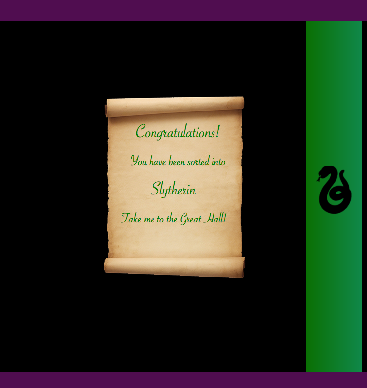
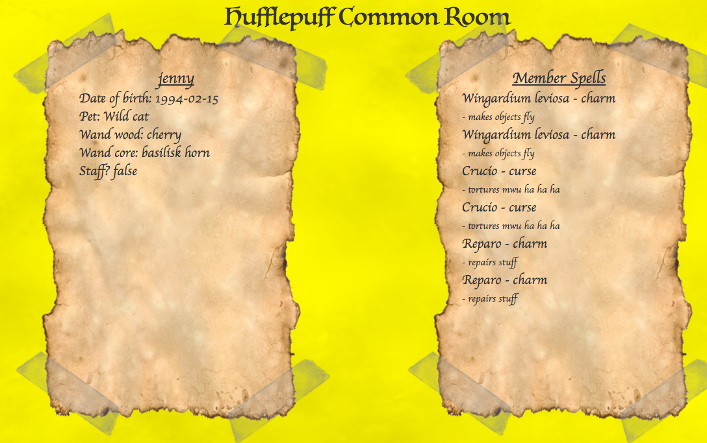

# hogwarts-app

The ultimate Harry Potter fansite - get sorted into a house and create your own spells!

## How to run

 - Clone the git repository
 - Run bundle in the terminal
 - Start the rails server with rails s
 - Go to localhost:3000 in your browser
 - Enter Hogwarts!

## Languages and Frameworks

- Ruby 2.4.1
- Rails 5.1.2
- Postgresql
- Devise
- Bootstrap sass

## Screenshots

Login screen

Displaying result of the sorting quiz

User page

